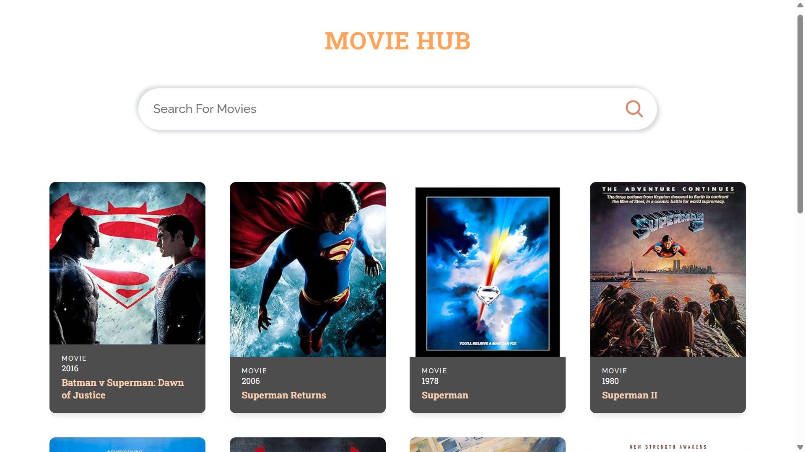

# 🎬 Movie Recommender App
---

A modern and responsive Movie Search App built with **React**, **Recoil** for state management, and styled beautifully with CSS. It fetches movie data from the [OMDb API](https://www.omdbapi.com/) and displays results based on user search input.

🔗 **Live App**: [View on GitHub Pages](https://amandeeptyagi.github.io/movies-recommender-app/)

---

## 🚀 Features

- 🔍 Search for movies by name
- 🎥 View movie details like poster, title, year, and type
- 📷 Graceful fallback if the poster image is missing
- ⚡ Fast, responsive design with smooth interactions
- 💡 Recoil-powered global state management

---

## 📸 Screenshots

### 🏠 Homepage (Default Search: Superman)



### 🔎 After Searching “Batman”


---

## 🛠️ Installation
---

### Clone the repository and install dependencies:

```bash
git clone https://github.com/amandeeptyagi/movies-recommender-app.git
cd movies-recommender-app
npm install
```

### Setup `.env` file

Create a `.env` file in the root directory and add your OMDB API key:

```env
VITE_OMDB_API_KEY=your_OMDB_api_key_here
```

> Get your API key from: https://www.omdbapi.com/


## ▶️ Start the development server
```bash
npm run dev
```
---
# 🧱 Tech Stack

- React – For building UI components
- Recoil – For global state management
- OMDb API – To fetch movie data
- CSS – Custom responsive styling
- Vite – For blazing-fast development

# 📁 Project Structure
movies-recommender-app/
│
├── public/
├── src/
│   ├── App.css
│   ├── App.jsx
│   ├── index.css
│   ├── main.jsx
│   ├── MovieCard.jsx
│   └── assets/
│       ├── react.svg
│       └── search.svg
├── .env
├── .git/
├── dist/
├── node_modules/
├── package.json
├── README.md

# 🙌 Acknowledgements
- OMDb API: https://www.omdbapi.com/
- Placeholder Images: https://placehold.co/


---

> Made with ❤️ by Amandeep Tyagi

>🙏If you like this repo please give a star⭐😊.